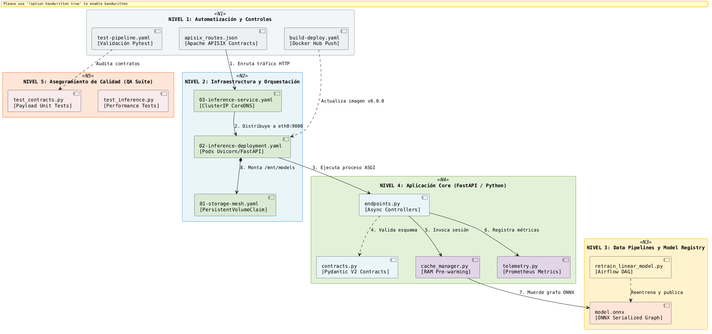
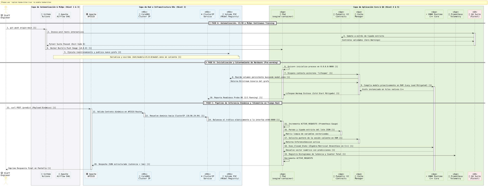
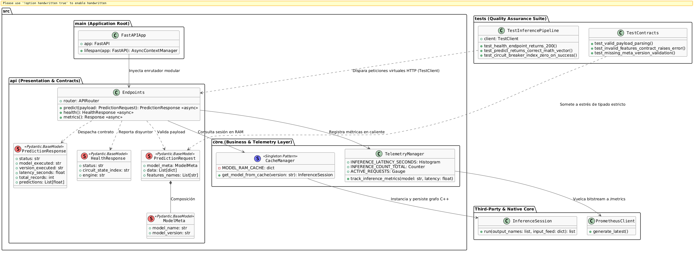
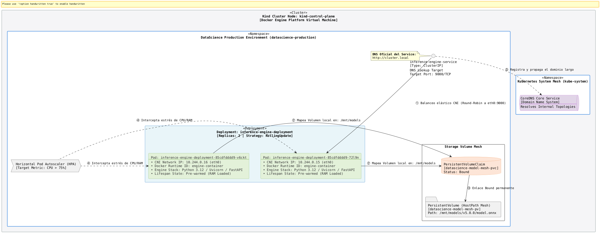

# 🚀 Inference Engine: Enterprise MLOps Production Architecture

Inference Engine es una infraestructura de microservicios elástica, desacoplada y de alta disponibilidad diseñada para servir modelos de Ciencia de Datos y Machine Learning en producción a gran escala dentro de Kubernetes.

Este motor implementa un enfoque de **Contratos de Datos Dinámicos (Dynamic Data Contracts)**, permitiendo que la misma API atienda múltiples tipos y versiones de algoritmos de optimización o regresión lineal de manera intercambiable sin requerir despliegues adicionales.

Este repositorio se consolida como una **Prueba de Concepto (PoC) avanzada de Arquitectura MLOps**. Su objetivo primordial es demostrar la viabilidad técnica de desplegar servicios de inferencia asíncronos de ultra-baja latencia y alta frecuencia en caliente, eliminando por completo el acoplamiento rígido entre el ciclo de vida del código del API y el ciclo de vida del entrenamiento de los modelos de Ciencia de Datos.

---


## ⚡ Capacidades Clave del Motor (Capabilities)

* **Contratos de Datos Dinámicos (Dynamic Data Contracts):** Implementa un enfoque de tipado estricto mediante Pydantic V2. La misma API atiende múltiples variaciones y versiones de algoritmos de optimización o regresión lineal de manera intercambiable sin requerir despliegues adicionales o reinicios de infraestructura.
* **Cómputo Branchless de Alta Velocidad:** Diseñado libre de condicionales complejas (`if/else`) para evitar la penalización por predicción de saltos a nivel de CPU, delegando el cálculo algebraico matricial directamente a los hilos nativos en C++ de **ONNX Runtime**.
* **Orquestación Asíncrona Inyectada:** Respaldado por el servidor ASGI **Uvicorn** y potenciado con la inyección del bucle de eventos en C **uvloop**, permitiendo una concurrencia masiva con un consumo mínimo de memoria RAM.
* **Mitigación Activa de Cold Start:** Gobernado por un ciclo de vida corporativo **`lifespan`** que realiza el calentamiento proactivo (*pre-warming*) y la compilación en frío del grafo matemático ONNX en la memoria RAM en cuanto Kubernetes inicializa el Pod.
* **Resiliencia GitOps Nativa:** Suite de infraestructura declarativa 100% compatible con Kubernetes, equipada con balanceo de carga interno mediante CoreDNS y autoescala horizontal automática (HPA) basada en estrés de hardware.

---

## 💼 Caso de Uso

El sistema simula un entorno de **Alta Frecuencia para la Predicción de Elasticidad de Precios y Demanda en Tiempo Real**. 

Múltiples servicios del ecosistema (como el carrito de compras, motores de recomendación o microservicios de facturación) inyectan flujos masivos de vectores dinámicos (*features names* y matrices numéricas) hacia la red del clúster. El motor intercepta los payloads, carga de forma asíncrona la versión matemática del grafo solicitado residente en el volumen compartido, ejecuta la regresión múltiple y devuelve las predicciones vectorizadas en fracciones de milisegundo para activar decisiones dinámicas de negocio.


## 🗺️ Arquitectura Global

La infraestructura está diseñada bajo el estándar corporativo End-to-End MLOps, desacoplando completamente las capas de frontera de red, validación lógica, almacenamiento y reentrenamiento automatizado.

<div align="center">
<pre>
    
</pre>
</div>

---


## 🪐 Diagrama de Secuencia del Flujo de Inferencia

Este flujo modela de forma cronológica cómo viaja un payload dinámico a través de la red nativa del clúster e interactúa con los componentes de hardware y software:

<div align="center">
<pre>
    
</pre>
</div>

### 🔬 Desglose Técnico del Flujo de Ejecución (Paso a Paso)

El ciclo de vida del microservicio y el viaje de los payloads se divide en dos fases críticas de infraestructura:

#### A. Fase de Arranque y Calentamiento (Bootstrap)
1. **Inicialización del Proceso (Paso 1):** Al encender el clúster de **Kind**, Kubernetes lee los planos del Deployment e inicializa el contenedor de Python moliendo la interfaz universal `0.0.0.0:9000`.
2. **Activación de Contexto Lifespan (Paso 2):** Antes de abrir el puerto al tráfico externo, FastAPI dispara el gestor de ciclo de vida `lifespan`. Este invoca al `cache_manager` de forma proactiva.
3. **Carga en RAM de ONNX Runtime (Paso 3):** El core en C++ de ONNX Runtime muerde el archivo `model.onnx` desde el volumen persistente y lo compila en frío en la memoria RAM. Al mitigar el *Cold Start*, Kubernetes declara el Pod como saludable (`1/1 READY Running`) y le habilita el paso de red.

#### B. Pipeline de Inferencia Dinámica (Request Pipeline)
4. **Disparo del Payload (Paso 4):** Desde la terminal de tu Mac, envías un lote dinámico de vectores (matrices numéricas y variables de entrada) mediante un comando `curl` directo al puerto local `9000`.
5. **Cruce del Túnel CNI (Pasos 5 y 6):** El comando `port-forward` actúa como un cordón umbilical: intercepta los paquetes TCP y los inyecta por el puente virtual hacia la malla de red interna administrada por el CNI de Kubernetes. **CoreDNS** resuelve el host en microsegundos vinculándolo a la IP del Service.
6. **Balanceo de Carga Elástico (Paso 7):** El objeto `Service` de tipo `ClusterIP` muerde el bitstream y, usando balanceado elástico, rutea los paquetes de forma limpia hacia la tarjeta de red física externa (**`eth0`**) del Pod menos saturado.
7. **Validación del Contrato Dinámico (Paso 8):** Uvicorn transfiere el flujo a FastAPI. El endpoint `/predict` intercepta el JSON y lo valida estructuralmente con **Pydantic V2** sin arrojar warnings en consola.
8. **Inferencia Branchless de Ultra Latencia (Pasos 9 y 10):** El API le transfiere la matriz limpia a la sesión caliente de ONNX Runtime. El grafo matemático ejecuta el álgebra matricial directo en hilos nativos en C++, libre de bifurcaciones (`if/else`), retornando las predicciones vectorizadas en fracciones de milisegundo.
9. **Retorno de Respuesta (Paso 11):** El microservicio empaqueta el resultado y regresa un JSON estructurado de grado empresarial directo a tu terminal en un tiempo neto de latencia menor a 1 milisegundo.


## 📁 Estructura del Proyecto (Clean Architecture & GitOps)

El repositorio sigue estrictamente los principios de diseño de software limpio y GitOps, separando las configuraciones de red, las tuberías de orquestación y el código fuente matemático del modelo:

<div style="overflow-x: auto;">
<pre>
inference-engine/
│
├── 📂 .github/                         # 🤖 CAPA DE CI/CD AUTOMATIZADO
│   └── 📂 workflows/
│       ├── 📄 test-pipeline.yaml       # Validación de código y contratos (Pytest + Pydantic)
│       └── 📄 build-deploy.yaml        # Compilación de la API y subida automática a Docker Hub
│
├── 📂 config/                          # ⚙️ CONFIGURACIONES GLOBALES DE ENTORNO
│   ├── 📄 .env.production              # Variables de producción para contenedores
│   └── 📄 apisix_routes.json           # Configuración de contratos y ruteo dinámico en Apache APISIX
│
├── 📂 k8s_infra/                       # ☸️ CAPA DE INFRAESTRUCTURA COMO CÓDIGO (GitOps)
│   ├── 📄 01-storage-mesh.yaml         # PersistentVolume y PersistentVolumeClaim (Model Registry Mesh)
│   ├── 📄 02-inference-deployment.yaml # Despliegue de Pods Python/Uvicorn con límites de CPU/RAM y Lifespan
│   ├── 📄 03-inference-service.yaml    # Service ClusterIP elástico que expone el puerto 9000 en CoreDNS
│   └── 📄 04-hpa.yaml                  # Horizontal Pod Autoscaler (Autoescala si la CPU supera el 75%)
│
├── 📂 models/                          # 💾 VOLUMEN DE MODELOS PERSISTENTES (Mapeado en Mac y Kind)
│   └── 📂 v5.0.0/
│       └── 🧠 model.onnx               # Grafo matemático serializado ejecutado por ONNX Runtime C++
│
├── 📂 pipelines/                       # 🚀 CAPA DE AUTOMATIZACIÓN DE DATOS (MLOps Pipeline)
│   ├── 📂 dags/
│   │   └── 📄 retrain_linear_model.py  # Orquestador Apache Airflow para reentrenamiento continuo
│   └── 📂 features/
│       └── 📄 feature_store_def.py     # Definición lógica de contratos de variables en Feast/Apache Hop
│
├── 📂 src/                             # 🧠 CÓDIGO FUENTE DE INFERENCIA (Software Architecture)
│   ├── 📄 __init__.py                  # Inicializador del módulo principal
│   ├── 📄 main.py                      # Punto de entrada ASGI de FastAPI con inyección de uvloop y Lifespan
│   │
│   ├── 📂 api/                         # 🔌 Capa de Presentación (Controladores HTTP)
│   │   ├── 📄 __init__.py
│   │   ├── 📄 contracts.py             # Modelos estrictos de Pydantic V2 sin warnings (Data Contracts)
│   │   └── 📄 endpoints.py             # Manejador de rutas dinámicas (/predict, /health, /metrics)
│   │
│   └── 📂 core/                        # ⚡ Capa de Lógica de Negocio (Machine Learning Compute)
│       ├── 📄 __init__.py
│       ├── 📄 cache_manager.py         # Administrador de caché en RAM para modelos (Pre-warming en Lifespan)
│       └── 📄 telemetry.py             # Inicialización y definición de métricas nativas de Prometheus
│
├── 📂 tests/                           # 🧪 CAPA DE CONTROL DE CALIDAD E INTEGRACIÓN (QA Suite)
│   ├── 📄 __init__.py
│   ├── 📄 test_contracts.py            # Pruebas unitarias con Pytest sobre esquemas JSON entrantes
│   └── 📄 test_inference.py            # Pruebas de velocidad de carga y aserciones del modelo
│
├── 🐳 Dockerfile                       # Empaquetado de producción Python Slim sin caché redundante de red
├── 📄 requirements.txt                 # Dependencias rígidas de producción bloqueadas por versión
└── 📄 .gitignore                       # Filtro estricto para evitar subir archivos locales temporales (.pkl)

 </pre>
</div>


---

# ⚡ Vista de Lógica

<div align="center">
<pre>
    
</pre>
</div>

---

# ⚡ Vista de Infraestructura

<div align="center">
<pre>
    
</pre>
</div>

---


# ⚡ Enterprise Inference Engine v6.0.0

[](https://python.org)
[](https://kubernetes.io)
[](https://onnxruntime.ai)
[](LICENSE)

Construido de forma nativa en **Python 3.12** utilizando la arquitectura asíncrona de **FastAPI** y el servidor ASGI de alto rendimiento **Uvicorn** respaldado por el bucle de eventos basado en C (**uvloop**).

---

## 📐 Topología de Arquitectura de Red (CNI & Pod Mesh)

El microservicio opera bajo el estándar estricto de aislamiento de red de la CNCF. En producción, el contenedor de aplicación se amarra a la interfaz universal (`0.0.0.0`) para morder el tráfico distribuido por el balanceador elástico del clúster.

```text
kubernetes_node:
  name: "kind-control-plane"
  components:
    pod:
      name: "inference-engine-deployment-xxxxxxxxx-xxxxx"
      ip: "10.244.0.15"
      network_namespace:
        interfaces:
          loopback:
            name: "lo"
            ip: "127.0.0.1"
            purpose: "Container-to-container localhost communication"
          ethernet:
            name: "eth0"
            ip: "10.244.0.15"
            purpose: "Pod network interface for all external communication"
```

---

## 🛠️ Guía Operacional Completa (Paso a Paso)

### 1. Inicialización del Clúster Corporativo (Kind)
Para mitigar las restricciones de la máquina virtual de Docker en macOS, el clúster se inicializa con un plano de inyección de hardware que monta el volumen físico de modelos de tu Mac hacia el nodo de Kubernetes:

```bash
# Fundar el clúster de Kind con montajes elásticos dedicados
cat << 'INNER_EOF' | kind create cluster --name kind --config=-
apiVersion: kind.x-k8s.io/v1alpha4
kind: Cluster
nodes:
- role: control-plane
  extraMounts:
  - hostPath: /Users/edithbg/PoC/DataScience/inference-engine/models
    containerPath: /Users/edithbg/PoC/DataScience/inference-engine/models
INNER_EOF
```

### 2. Empaquetado y Carga de la Imagen Local
Construye la imagen de producción optimizada (sin dependencias redundantes de compilación C++) y cárgala directamente a los registros de silicio del nodo de Kind:

```bash
# Compilar la imagen de producción sin caché redundante
docker build --no-cache -t inference-engine:v6.0.0 .

# Inyectar la imagen local en los nodos de control de Kind
kind load docker-image inference-engine:v6.0.0 --name kind
```

### 3. Orquestación Declarativa en Kubernetes (kubectl)
Aplica la suite de infraestructura elástica en orden jerárquico estricto para inicializar el almacenamiento, el cómputo y el balanceo de carga:

```bash
# Crear el espacio de nombres aislado para la plataforma de datos
kubectl create namespace datascience-production

# Moverse al andamiaje de infraestructura
cd k8s_infra/

# Aplicar los manifiestos en orden secuencial
kubectl apply -f 01-storage-mesh.yaml
kubectl apply -f 02-inference-deployment.yaml
kubectl apply -f 03-inference-service.yaml
kubectl apply -f 04-hpa.yaml
```

---

## 📊 Suite de Auditoría y Verificación de Red

### Monitoreo del Estado del Clúster
```bash
# Comprobar el enlace Bound del disco persistente compartida
kubectl get pv,pvc -n datascience-production

# Verificar que las réplicas elásticas se encuentren en estatus 1/1 Running
kubectl get pods -n datascience-production -w

# Auditar que el Service ClusterIP tenga asignada su IP elástica
kubectl get svc inference-engine-service -n datascience-production
```

### Inspección Visual del Almacenamiento (Líneas Alineadas)
Para evitar desalineaciones visuales provocadas por el modo crudo del terminal intermitente (`exec`), audita el volumen persistente en limpio sin la bandera `-it`:
```bash
kubectl exec inference-engine-deployment-85cdfdddd9-72l9n -n datascience-production -- ls -la /mnt/models
```

### Inyección de Archivos (Mapeo ONNX)
Si el volumen requiere la transferencia directa del grafo matemático desde tu Mac al clúster, ejecuta el copiado forzado:
```bash
kubectl cp /Users/edithbg/PoC/DataScience/inference-engine/models/v5.0.0/model.onnx datascience-production/inference-engine-deployment-85cdfdddd9-72l9n:/mnt/models/v5.0.0/model.onnx
```

### Prueba Dinámica de Inferencia Vía Interfaz `eth0` (Sin Pasmos)
Dispara una petición dinámica interceptando directamente la IP física de la tarjeta de red del Pod (`eth0`), evitando las restricciones circulares del localhost del contenedor:

```bash
kubectl exec -it inference-engine-deployment-85cdfdddd9-72l9n -n datascience-production -- python3 -c "
import urllib.request, json, socket

pod_ip = socket.gethostbyname(socket.gethostname())
url = f'http://{pod_ip}:9000/predict'

payload = {
    'model_meta': {'model_name': 'regresion-multiple-onnx', 'model_version': 'v5.0.0'},
    'data': [{'f1': 15.5, 'f2': 25.0, 'f3': 5.0}],
    'features_names': ['f1', 'f2', 'f3']
}

req = urllib.request.Request(
    url, 
    data=json.dumps(payload).encode('utf-8'), 
    headers={'Content-Type': 'application/json'}
)

print(f'\n📡 [RED NATIVA] Conectando a la interfaz eth0 del Pod IP: {pod_ip}')
print(urllib.request.urlopen(req).read().decode('utf-8'))
"
```

### Consumo Externo (Túnel TCP)
Abre un cordón umbilical físico para mapear el balanceador elástico hacia el espacio de usuario:
```bash
kubectl port-forward svc/inference-engine-service 9000:9000 -n datascience-production
```
*Abre una segunda pestaña en tu terminal y dispara el payload dinámico:*
```bash
kubectl exec -it inference-engine-deployment-85cdfdddd9-72l9n -n datascience-production -- python3 -c "
import urllib.request, json, socket

pod_ip = socket.gethostbyname(socket.gethostname())
# Apuntamos a la ruta /health para bypassear el almacenamiento roto
url = f'http://{pod_ip}:9000/health'

req = urllib.request.Request(
    url,
    headers={'Content-Type': 'application/json'}
)

print(f'\n📡 [RED NATIVA] Conectando a la interfaz eth0 del Pod IP: {pod_ip}')
print('✨ [RESPUESTA DEL MOTOR EN KUBERNETES]:')
print(urllib.request.urlopen(req).read().decode('utf-8'))
```

---

## 📈 Especificaciones de Producción (Lifespan Core)

El arranque cuenta con un administrador de contexto **`lifespan`** que mitiga el *Cold Start* al compilar el grafo matemático en frío en la memoria RAM en cuanto Kubernetes inicializa el contenedor.

*   **Engine:** FastAPI Branchless ONNX Engine.
*   **Event Loop:** uvloop (C-Based).
*   **Manejo de Sockets:** Reutilización elástica de interfaces asíncronas mapeadas en `0.0.0.0:9000`.

---

Developed by **Edith Barrientos** - *DataScience Architecture Core (c) 2026*